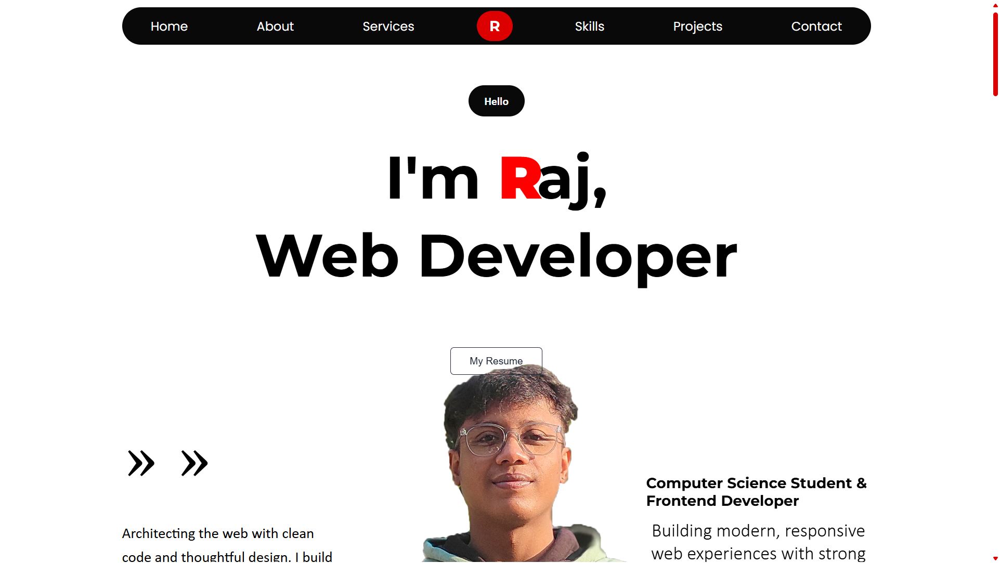

# 🚀 Rajdeep DebRoy - Portfolio

 <!-- Add your screenshot later -->

A modern, animated web developer portfolio built with vanilla JavaScript and GSAP animations. Features smooth scrolling, interactive elements, and responsive design.

## ✨ Live Demo
[**🌐 View Live Portfolio**](https://rajdeepdroy-portfolio.netlify.app//)

## 📁 Project Structure
```
portfolio/
├── index.html          # Main HTML file
├── style.css          # All CSS styles
├── script.js          # JavaScript with GSAP animations
├── port.png           # Profile image
├── 1st project.png    # Project 1 screenshot
├── 2nd project.png    # Project 2 screenshot
└── 3rd project.png    # Project 3 screenshot
```

## 🎯 Features

### 🎨 UI/UX
- Dark theme with red accent colors
- Fully responsive design (mobile-first)
- Custom scrollbar styling
- Smooth hover effects
- Interactive project tabs

### ⚡ Animations
- GSAP-powered scroll animations
- Text splitting & character reveal
- Skill bar progress animations
- Section reveal on scroll
- Project tab transitions

### 🛠️ Technical
- Vanilla JavaScript (no frameworks)
- CSS Grid & Flexbox layouts
- Smooth scrolling with offset fix
- Copy-to-clipboard functionality
- Performance optimized

## 🚀 Quick Start

1. **Clone the repository:**
```bash
git clone https://github.com/yourusername/your-portfolio.git
```

2. **Navigate to the project:**
```bash
cd your-portfolio
```

3. **Open in browser:**
   - Simply open `index.html` in your browser
   - No build process required!

## 📦 Deployment

### Netlify (Recommended)
1. Drag and drop your folder to Netlify
2. Or connect your GitHub repository

### GitHub Pages
1. Go to repository Settings
2. Navigate to "Pages"
3. Select "main" branch as source
4. Your site will be at: `https://username.github.io/repository`

### Vercel
1. Import your Git repository
2. Vercel automatically deploys

## 🛠️ Tech Stack

### Core Technologies
- **HTML5** - Semantic markup
- **CSS3** - Modern styling with CSS Grid & Flexbox
- **JavaScript (ES6+)** - Interactive functionality
- **GSAP 3** - Professional animations
- **ScrollTrigger** - Scroll-based animations

### External Libraries
- **Font Awesome** - Icons
- **Google Fonts** - Typography (Poppins, Montserrat)

### Performance
- Optimized image loading
- Lazy loading for animations
- Minimal external dependencies
- Efficient CSS selectors

## 🔧 Customization

### Personal Information
Edit `index.html` to update:
- Your name and title
- Contact information
- Social media links
- Project details

### Styling
Modify `style.css` to change:
- Color scheme (update `#DC0000` for accent color)
- Font sizes and weights
- Animation timings
- Layout spacing

### Projects
Update project information in the Projects section:
```html
<!-- In index.html -->
<div class="project-tab" id="project1">
    <h3>Your Project Title</h3>
    <p>Your project description</p>
    <!-- Update images, links, and tech stack -->
</div>
```

## 🎮 Navigation Fix (Important!)

### The Problem
When clicking navbar links, the page would scroll to sections but animations wouldn't trigger until manual scrolling.

### The Solution
Added ScrollTrigger refresh after programmatic scrolling:
```javascript
// After scrolling to section
gsap.to(window, {
    scrollTo: { y: targetElement, offsetY: 80 },
    duration: 1,
    ease: "power2.inOut",
    onComplete: () => {
        ScrollTrigger.refresh(); // This fixes it
    }
});
```

## 📝 Code Structure

### JavaScript (`script.js`)
- **Hero Animations** - Text splitting and profile image effects
- **Section Reveals** - Scroll-triggered section animations
- **Skill Bars** - Animated progress indicators
- **Project Tabs** - Interactive tab switching
- **Footer Functions** - Contact and copy functionality

### CSS (`style.css`)
- **Global Styles** - Reset, fonts, colors
- **Navigation** - Navbar styling and responsiveness
- **Sections** - Each portfolio section styling
- **Animations** - Keyframes and transitions
- **Responsive** - Media queries for all devices

## 📱 Responsive Breakpoints
- **Desktop**: > 1024px
- **Tablet**: 768px - 1023px
- **Mobile**: < 767px
- **Small Mobile**: < 360px

## 🐛 Known Issues & Fixes

### Issue: Animations don't trigger after navbar click
**Fix**: Added `ScrollTrigger.refresh()` in navigation click handlers

### Issue: Navbar overlaps section content
**Fix**: Added offset calculation (`offsetY: 80`) for smooth scrolling

### Issue: Mobile menu issues
**Fix**: Implemented responsive navbar with flex-wrap

## 🤝 Contributing
1. Fork the repository
2. Create a feature branch (`git checkout -b feature/AmazingFeature`)
3. Commit your changes (`git commit -m 'Add some AmazingFeature'`)
4. Push to the branch (`git push origin feature/AmazingFeature`)
5. Open a Pull Request

## 📄 License
This project is open source and available under the [MIT License](LICENSE).

## 👤 Author
**Rajdeep DebRoy**
- GitHub: [@sticktostack](https://github.com/sticktostack)
- LinkedIn: [rajdeep-debroy](https://www.linkedin.com/in/rajdeep-debroy/)
- Email: raajdeepdroy@gmail.com

## 🙏 Acknowledgments
- [GSAP](https://greensock.com/gsap/) for amazing animation library
- [Font Awesome](https://fontawesome.com/) for icons
- [Google Fonts](https://fonts.google.com/) for typography
- [Netlify](https://www.netlify.com/) for hosting

---

⭐ **If you find this portfolio helpful, please give it a star!** ⭐